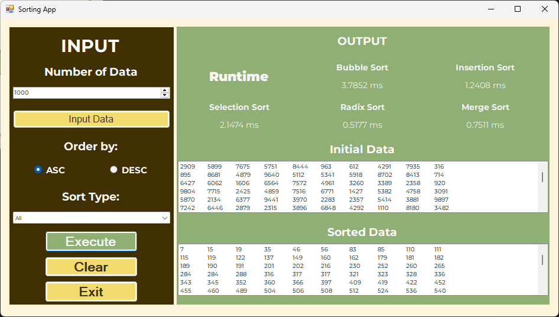

<header id="readme-top">
  <div align="center">
    
    <h1>Sortihm*</h1>
    <p><i>*The name is used solely as a project identifier. Any resemblance to existing names, trademarks, brands, or copyrighted works is unintentional. All rights remain with their respective owners.</i></p>
    <p>A Windows Forms sorting application for comparing multiple sorting algorithms on randomly generated data.</p>
    <p>
      The project lets you generate a data set, choose a sort order, and run Bubble Sort, Insertion Sort,
      Selection Sort, Radix Sort, or Merge Sort to compare their behavior and execution time.
    </p>
    <a href="#installation">Installation</a>
    &middot;
    <a href="#algorithms">Algorithms</a>
    &middot;
    <a href="#usage">Usage</a>
    <br><br>
    
    
    
  </div>
</header>

<hr>

<details>
  <summary>Table of Contents</summary>
  <ol>
    <li><a href="#overview">Overview</a></li>
    <li><a href="#structure">Structure</a></li>
    <li><a href="#prerequisites">Prerequisites</a></li>
    <li><a href="#installation">Installation</a></li>
    <li><a href="#usage">Usage</a></li>
    <li><a href="#algorithms">Algorithms</a></li>
    <li><a href="#demo">Demo</a></li>
    <li><a href="#license">License</a></li>
  </ol>
</details>

<section id="overview">
  <header>
    <h2>Overview</h2>
  </header>
  <p>
    Sortihm is a desktop application built in C# and Windows Forms for studying sorting algorithms in a practical way.
    It generates random integer data, displays the unsorted values, and then sorts the same data set using a selected
    algorithm and order.
  </p>
  <p>
    The app includes a shared sorting library and a WinForms user interface, making it easy to compare algorithm output
    and timing results from one place.
  </p>
  <p align="right"><a href="#readme-top">Back to top</a></p>
</section>

<br>

<a id="structure"></a>

## Structure

<pre><code>Sortihm/
├── Sortihm.sln            # Visual Studio solution
├── SortingLib/            # Sorting algorithms library
│   ├── BubbleSort.cs
│   ├── InsertionSort.cs
│   ├── MergeSort.cs
│   ├── RadixSort.cs
│   └── SelectionSort.cs
└── Sortihm/               # Windows Forms application
    ├── FormMain.cs        # Main UI logic
    ├── FormMain.Designer.cs
    ├── Program.cs
    └── Properties/</code></pre>
<p>
  The project is organized as a Visual Studio solution with a reusable sorting library and a WinForms front end.
</p>
<p align="right"><a href="#readme-top">Back to top</a></p>

<br>

<section id="prerequisites">
  <header>
    <h2>Prerequisites</h2>
  </header>
  <ul>
    <li>Visual Studio 2019 or later</li>
    <li>.NET Framework support for Windows Forms</li>
    <li>Windows operating system</li>
  </ul>
  <p align="right"><a href="#readme-top">Back to top</a></p>
</section>

<br>

<a id="installation"></a>

## Installation

1. Clone the repository.

```sh
git clone <REPOSITORY_URL>
cd Sortihm
```

2. Open the solution file in Visual Studio.

```sh
Sortihm\Sortihm.sln
```

3. Build the solution.

```sh
Build > Build Solution
```

4. Run the `Sortihm` project.

```sh
Start Debugging
```

<p align="right"><a href="#readme-top">Back to top</a></p>

<br>

<section id="usage">
  <header>
    <h2>Usage</h2>
  </header>
  <p>
    After launching the app, choose a quantity of random numbers, generate the initial data, select ascending or
    descending order, and pick a sorting algorithm from the list. The application shows the input values, the sorted
    values, and the elapsed time for the selected algorithm.
  </p>
  <p align="right"><a href="#readme-top">Back to top</a></p>
</section>

<br>

<section id="algorithms">
  <header>
    <h2>Algorithms</h2>
  </header>
  <p>The app includes the following sorting options:</p>
  <ul>
    <li>Bubble Sort</li>
    <li>Insertion Sort</li>
    <li>Selection Sort</li>
    <li>Radix Sort</li>
    <li>Merge Sort</li>
  </ul>
  <p align="right"><a href="#readme-top">Back to top</a></p>
</section>

<br>

<section id="demo">
  <header>
    <h2>Demo</h2>
  </header>

  <p align="center">
    
  </p>

  <p align="center">
    The main screen lets you generate data, choose the sort order, and compare the result of each algorithm.
  </p>

  <br>

  <p align="right">
    <a href="#readme-top">Back to top</a>
  </p>
</section>

<br>

<section id="license">
  <header>
    <h2>License</h2>
  </header>
  <p>Distributed under the MIT License. See <code>LICENSE</code> for more information.</p>
  <p align="right"><a href="#readme-top">Back to top</a></p>
</section>